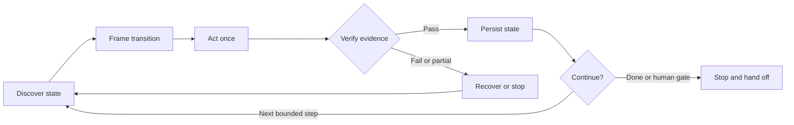

# GitHub Project Board Skill

> The GitHub-native control plane for Loop Engineering.

An Agent Skill that turns GitHub Issues and GitHub Projects into durable state, evidence, and handoff for repeatable agent work—all through the official [GitHub MCP Server](https://github.com/github/github-mcp-server).

Loop Engineering is about designing the repeatable system around an agent: what it discovers, which bounded transition it attempts, how the result is verified, what gets persisted, and when the loop continues or stops. This skill applies that discipline to the work lifecycle.



## The project board as loop memory

GitHub is more than the task list in this loop:

| Loop stage | What the skill does | Durable artifact |
|:--|:--|:--|
| Discover | Read live repository, issue, hierarchy, Project fields, and policy | Current world state |
| Frame | Define one authorized transition and the evidence that would prove it | Acceptance criteria and target state |
| Act | Make the smallest MCP mutation in dependency order | Issue or Project change |
| Verify | Re-read the affected resources instead of trusting the write response | Observed state and validation evidence |
| Persist | Record decisions, blockers, validation, and completion | Body, comments, fields, and links |
| Continue or stop | Route a bounded next step or stop at completion, ambiguity, or a human gate | Follow-up, handoff, or verified done state |

The result is an evidence-gated lifecycle: an agent cannot turn “I changed it” into “Done” without a read-back and proof.

## Why this skill

- **Loop-native:** every mutation is one pass through discover, frame, act, verify, and persist.
- **Evidence-gated:** acceptance criteria and current read-back state control lifecycle transitions.
- **Durable:** GitHub Issues and Projects carry context across agents, sessions, and human handoffs.
- **MCP-only:** no `gh` CLI, `curl`, direct REST calls, or handwritten GraphQL.
- **Repository-agnostic:** no hard-coded owner, project number, field ID, option ID, label, language, or status vocabulary.
- **Recoverable:** partial failures trigger a fresh read and bounded recovery, never blind replay.
- **Honest about limits:** missing tools, permissions, or authority become explicit stop conditions.

## What it manages

- issue creation, triage, assignment, priority, and status;
- project item attachment and custom field updates;
- sub-issue decomposition and hierarchy verification;
- blockers, implementation notes, and PR/commit references;
- evidence-backed acceptance criteria;
- completion, follow-up routing, and human handoff.

This is the lifecycle control and memory layer, not an autonomous scheduler or coding-agent runtime. It does not launch agents, run code, merge changes, or bypass a missing MCP capability.

## Contents

| Path | Purpose |
|:--|:--|
| `skills/github-project-board/SKILL.md` | Core loop, lifecycle rules, and safety contract |
| `skills/github-project-board/references/github-mcp-tools.md` | Official GitHub MCP tool map and payload patterns |
| `skills/github-project-board/references/work-item-format.md` | Portable issue, blocker, note, and completion formats |
| `skills/github-project-board/agents/openai.yaml` | Skill metadata and GitHub MCP dependency |

## Prerequisites

Connect the official GitHub MCP Server to your agent host with access to the target repository and GitHub Project.

Enable at least the `issues` and `projects` toolsets. `context`, `repos`, `labels`, and `pull_requests` are recommended for the full loop:

```text
context,repos,issues,labels,projects,pull_requests
```

The server's default toolsets can omit `projects`, so board operations require enabling it explicitly. Project writes also require project-write authorization. Follow the official server's [configuration guide](https://github.com/github/github-mcp-server/blob/main/docs/server-configuration.md) for your MCP host; do not commit access tokens.

## Install

With an Agent Skills-compatible installer:

```bash
npx skills add Ruisi-Lu/github-project-board-skill
```

Or copy the skill directory into the location used by your agent:

```bash
cp -R skills/github-project-board ~/.codex/skills/
```

For a repository-local Claude Code installation:

```bash
cp -R skills/github-project-board .claude/skills/
```

Restart or reload the agent host if it does not discover newly installed skills automatically.

## Use

Run one bounded work loop:

```text
Use $github-project-board to inspect issue #42 and its project item, choose the
next authorized transition, apply it, verify it, and persist the evidence.
```

Create and route work:

```text
Use $github-project-board to create an issue for the failing upload retries,
add it to our engineering project, set the existing priority to High, and
verify every resulting state.
```

Enforce a completion gate:

```text
Use $github-project-board to close issue #42 only if every acceptance criterion
has current evidence, then synchronize and verify the project status.
```

The skill follows repository instructions and existing project vocabulary. Ambiguous targets, insufficient evidence, missing capabilities, and new authority requirements stop the loop before an unsafe transition.

## Design boundaries

The skill targets the official GitHub MCP Server's documented tool surface. It never silently switches to a CLI or direct API. Native issue dependencies and arbitrary project configuration remain conditional on the tools exposed by the connected server.

The skill completes one requested lifecycle operation or bounded recovery at a time. Scheduling, isolated worktrees, coding-agent execution, independent code evaluation, deployment, and unattended repetition belong to the surrounding Loop Engineering harness.

## License

MIT — see [LICENSE](LICENSE).
