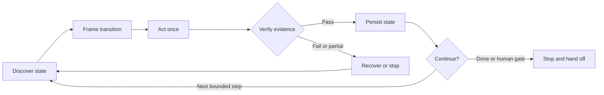

# GitHub Loop Engineering Skill

> The GitHub-native control plane for Loop Engineering.

An Agent Skill that turns GitHub Issues and GitHub Projects into durable state, evidence, and handoff for repeatable agent work—all through the official [GitHub MCP Server](https://github.com/github/github-mcp-server).

Loop Engineering is about designing the repeatable system around an agent: what it discovers, which bounded transition it attempts, how the result is verified, what gets persisted, and when the loop continues or stops. This skill applies that discipline to the work lifecycle.



## The project board as loop memory

GitHub is more than the task list in this loop:

| Loop stage | What the skill does | Durable artifact |
|:--|:--|:--|
| Discover | Read live repository, issue, hierarchy, Project fields, and policy | Current world state |
| Frame | Define one authorized transition and the evidence that would prove it | Acceptance criteria and target state |
| Act | Make the smallest MCP mutation in dependency order | Issue or Project change |
| Verify | Re-read the affected resources instead of trusting the write response | Observed state and validation evidence |
| Persist | Record decisions, blockers, validation, and completion | Body, comments, fields, and links |
| Continue or stop | Route a bounded next step or stop at completion, ambiguity, or a human gate | Follow-up, handoff, or verified done state |

The result is an evidence-gated lifecycle: an agent cannot turn “I changed it” into “Done” without a read-back and proof.

## Why this skill

- **Cold-startable:** every issue passes a cold-start check, so a new collaborator or a fresh agent session can act on it without chat history.
- **Loop-native:** every mutation is one pass through discover, frame, act, verify, and persist.
- **Evidence-gated:** acceptance criteria and current read-back state control lifecycle transitions.
- **Durable:** GitHub Issues and Projects carry context across agents, sessions, and human handoffs.
- **Assignment at start:** issues are created unassigned. The agent asks whether to assign the user when work starts, unless the request or repository policy already decides.
- **MCP-only:** no `gh` CLI, `curl`, direct REST calls, or handwritten GraphQL.
- **Host-portable:** the skill is standard Agent Skills content with no vendor-specific agent metadata. The Claude Code plugin is an optional wrapper that installs the same files unchanged.
- **Repository-agnostic:** no hard-coded owner, project number, field ID, or option ID. Existing repository vocabulary always wins. A baseline vocabulary applies only when the user authorizes first-use initialization.
- **Recoverable:** partial failures trigger a fresh read and bounded recovery, never blind replay.
- **Honest about limits:** missing tools, permissions, or authority become explicit stop conditions.

## What it manages

- first-use initialization of labels, issue templates, the Project board, and its automations;
- cold-startable issue creation, triage, assignment, priority, and status;
- project item attachment and custom field updates;
- sub-issue decomposition and hierarchy verification;
- blockers, implementation notes, and PR/commit references;
- evidence-backed acceptance criteria;
- completion, follow-up routing, and human handoff.

This is the lifecycle control and memory layer, not an autonomous scheduler or coding-agent runtime. It does not launch agents, run code, merge changes, or bypass a missing MCP capability. Initialization proposes issue templates through a pull request and leaves the merge to a human. Board fields, workflows, and issue types need the GitHub UI, so the agent hands those steps to the user.

## Contents

| Path | Purpose |
|:--|:--|
| `skills/github-loop-engineering-skill/SKILL.md` | Core loop, lifecycle rules, and safety contract |
| `skills/github-loop-engineering-skill/references/github-mcp-tools.md` | Official GitHub MCP tool map and payload patterns |
| `skills/github-loop-engineering-skill/references/work-item-format.md` | Cold-start contract and check, plus issue, blocker, note, and completion formats |
| `skills/github-loop-engineering-skill/references/initialization.md` | First-use detection, authorization gate, and baseline for labels, board, automations, and templates |
| `skills/github-loop-engineering-skill/assets/issue-templates/` | Cold-start issue templates (`en`, `zh-TW`) that initialization installs into `.github/ISSUE_TEMPLATE/` |
| `.claude-plugin/plugin.json` | Claude Code plugin manifest and release version |
| `.claude-plugin/marketplace.json` | Single-plugin Claude Code marketplace catalog |
| `scripts/` | Bun and TypeScript repository checks (development only) |
| `CHANGELOG.md` | Release history |

## Bootstrap the GitHub MCP dependency

This skill has one runtime dependency: the official [github/github-mcp-server](https://github.com/github/github-mcp-server).

If it is not connected, ask the agent to bootstrap it:

```text
Install or connect the official github/github-mcp-server for this MCP host.
Use the host's supported installation method, keep credentials out of files
and chat, enable the toolsets required by the GitHub Loop Engineering skill, reload
the tools, verify the connection, and then resume the original request.
```

The agent should perform the setup itself when the host exposes an approved installer, connector manager, or shell workflow. Installation is host-specific: prefer the official remote server when supported; otherwise use the official container or binary instructions. Do not assume that cloning the source repository configures an MCP host.

Before downloading software, changing user/global host configuration, or starting an authentication flow, the agent must obtain any approval required by the host. Store OAuth or PAT credentials through the host's secret/input mechanism or environment—not in the repository, skill, command transcript, or chat.

Enable at least the `issues` and `projects` toolsets. `context`, `repos`, `labels`, and `pull_requests` are recommended for the full loop:

```text
context,repos,issues,labels,projects,pull_requests
```

The server's default toolsets (`context`, `issues`, `pull_requests`, `repos`, `users`) omit `projects` and `labels`, so you must enable them explicitly for board operations. The remote server takes toolsets from the `X-MCP-Toolsets` header. The local server reads the `--toolsets` flag or the `GITHUB_TOOLSETS` variable. Project writes also require project-write authorization. Follow the official server's [configuration guide](https://github.com/github/github-mcp-server/blob/main/docs/server-configuration.md) for the detected MCP host.

After setup, verify that identity, issue reads, Project reads, and the requested write tools are actually available. Only then resume the skill at Discover.

### Claude Code example

The plugin doesn't bundle an MCP server. That keeps credentials out of the plugin and avoids a second GitHub server when one is already connected. To connect the official remote server for your user, export a GitHub token in your shell first. The shell expands it once, and Claude Code stores the result in your user configuration, not in any repository:

```bash
claude mcp add --transport http --scope user github https://api.githubcopilot.com/mcp/ \
  --header "Authorization: Bearer $GITHUB_PAT" \
  --header "X-MCP-Toolsets: context,repos,issues,labels,projects,pull_requests"
```

To share the setup with a team, commit a project `.mcp.json` in the target repository. Claude Code expands `${GITHUB_PAT}` from each member's environment when it loads the file, so the committed file holds no secret:

```json
{
  "mcpServers": {
    "github": {
      "type": "http",
      "url": "https://api.githubcopilot.com/mcp/",
      "headers": {
        "Authorization": "Bearer ${GITHUB_PAT}",
        "X-MCP-Toolsets": "context,repos,issues,labels,projects,pull_requests"
      }
    }
  }
}
```

Run `/mcp` to confirm the connection, and approve the project server when Claude Code prompts.

## Install

### Claude Code plugin

This repository is also a Claude Code plugin marketplace. In a Claude Code session:

```text
/plugin marketplace add Ruisi-Lu/github-loop-engineering-skill
/plugin install github-loop-engineering@github-loop-engineering
```

Or from your shell:

```bash
claude plugin marketplace add Ruisi-Lu/github-loop-engineering-skill
claude plugin install github-loop-engineering@github-loop-engineering
```

Run `/reload-plugins` or start a new session to load it. The plugin pins its release version, so a new release reaches you only after the version changes. Third-party marketplaces don't auto-update by default. Enable auto-update in the `/plugin` **Marketplaces** tab, or update manually:

```bash
claude plugin marketplace update github-loop-engineering
claude plugin update github-loop-engineering@github-loop-engineering
```

To enable the plugin for everyone who works in a repository, commit this to that repository's `.claude/settings.json`:

```json
{
  "extraKnownMarketplaces": {
    "github-loop-engineering": {
      "source": {
        "source": "github",
        "repo": "Ruisi-Lu/github-loop-engineering-skill"
      }
    }
  },
  "enabledPlugins": {
    "github-loop-engineering@github-loop-engineering": true
  }
}
```

### Other Agent Skills hosts

With an Agent Skills-compatible installer:

```bash
npx skills add Ruisi-Lu/github-loop-engineering-skill
```

Or copy the skill directory into the location used by your agent:

```bash
cp -R skills/github-loop-engineering-skill ~/.codex/skills/
```

For a standalone Claude Code skill without the plugin wrapper:

```bash
cp -R skills/github-loop-engineering-skill .claude/skills/
```

Install either the plugin or a standalone copy in Claude Code, not both. With both, the same skill loads twice under different names.

Restart or reload the agent host if it does not discover newly installed skills automatically.

## Use

The skill triggers automatically when a request matches its description. To invoke it explicitly:

| Host | Invocation |
|:--|:--|
| Claude Code plugin | `/github-loop-engineering:github-loop-engineering-skill` |
| Claude Code standalone skill | `/github-loop-engineering-skill` |
| Codex | `$github-loop-engineering-skill` |

Run one bounded work loop:

```text
Use the GitHub Loop Engineering skill to inspect issue #42 and its project item,
choose the next authorized transition, apply it, verify it, and persist the evidence.
```

Create and route work:

```text
Use the GitHub Loop Engineering skill to create an issue for the failing upload
retries, add it to our engineering project, set the existing priority to High,
and verify every resulting state.
```

Enforce a completion gate:

```text
Use the GitHub Loop Engineering skill to close issue #42 only if every acceptance
criterion has current evidence, then synchronize and verify the project status.
```

Initialize a repository on first use:

```text
Use the GitHub Loop Engineering skill to set up this repository's issues and board
for the first time. Propose the labels, Project fields, automations, and zh-TW
issue templates, apply what I approve, and list the steps I must do in the UI.
```

The skill follows repository instructions and existing project vocabulary. Ambiguous targets, insufficient evidence, missing capabilities, and new authority requirements stop the loop before an unsafe transition.

## Design boundaries

The skill targets the official GitHub MCP Server's documented tool surface. It never silently switches to a CLI or direct API. Native issue dependencies and arbitrary project configuration remain conditional on the tools exposed by the connected server.

The skill completes one requested lifecycle operation or bounded recovery at a time. Scheduling, isolated worktrees, coding-agent execution, independent code evaluation, deployment, and unattended repetition belong to the surrounding Loop Engineering harness.

The Claude Code plugin packages only the skill. It adds no hooks, agents, commands, or MCP servers, so installing it grants no new tool access.

## Development

The toolchain is pinned in `.prototools` and managed with [proto](https://moonrepo.dev/proto). The repository checks live in `scripts/` so the plugin root never pairs a `package.json` with a lockfile. Claude Code would otherwise install those development dependencies for every plugin user.

```bash
proto install
cd scripts
bun install --frozen-lockfile
bun run check
```

`bun run check` type-checks the scripts. It then verifies that the marketplace entry matches `plugin.json`, that the latest `CHANGELOG.md` release matches the plugin version, that skill frontmatter is valid, and that relative Markdown links and anchors resolve. It finishes with `claude plugin validate --strict`, which is skipped with a warning locally when the Claude Code CLI is absent and required in CI.

To release:

1. Move the `Unreleased` changelog entries into a new version section.
2. Set the same version in `.claude-plugin/plugin.json`. Leave `version` out of `marketplace.json`, because `plugin.json` is the single source of truth.
3. Run `bun run check`, then commit.
4. Run `claude plugin tag . --push` to create and push the `github-loop-engineering--v<version>` tag.

## License

MIT — see [LICENSE](LICENSE).
